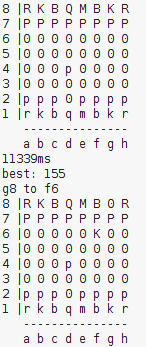
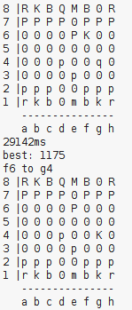
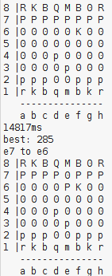

## Testit
Junitilla on tehty testejä, joilla selvitetään ohjelman toiminnan toimivuutta.
Testeissä on testattu tietorakentaita, logiikkaa ja peliin travittuja luokkia kuten lauta. Kaikkien testien syötteet ovat melko sattuman varaisia, koska testeissä olen testannut yleistä toimivuutta.

Olen myös tehnyt testauksia siitä kuinka paljon aikaa menee puun tekemiseen (ja samalla liikeiden arviointiin).
Ohjelma onnistui simuloimaan 4 vuoroa 5270 millisekunnissa, 3 vuoroa 284 millisekunnissa, 2 vuoroa vei 49 millisekunttia ja 1 vuoro noin 12 ms. Kun yritti 5 vuoroa, kesti se kauan ja lopulta tuli muistin ylivuoto.
Testin voi helposti tehdä käyttöliittymän kautta ohjelmassa.
Tosin tässä kaikki puut on tehty alkaen laudan alkutilanteesta.

Myös itse pelissä näkyy kuinka kauan tekoäly mietti liikettään.
joka on yleensä pidempi, vaikka koko puuta ei tarvitsekkaan tehdä uudestaan.

