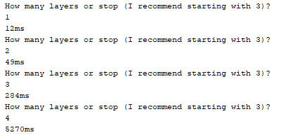

## Testit
Junitilla on tehty jonkin verran testejä, jotta saataisiin kaikki vaihtoehdot käytyä läpi taritaan todennäköisesti satoja testejä.
Testeissä on testattu tietorakentaita ja logiikkaa. Kaikkien testien syötteet ovat melko sattuman varaisia, koska testeissä olen testannut yleistä toimivuutta, kun kaikkien yksityiskohtien testaamiseen menisi todella paljon aikaa.

Olen myös tehnyt testauksia siitä kuinka paljon aikaa menee puun tekemiseen (ja samalla liikeiden arviointiin).
Ohjelma onnistui simuloimaan 4 vuoroa noin 4500 millisekunnissa, 3 vuoroa noin 400 millisekunnissa, 2 vuoroa vei 20 millisekunttia ja 1 vuoro noin 1 ms. Kun yritti 5 vuoroa, kesti se kauan ja lopulta tuli muistin ylivuoto.
aika testin voi helposti tehdä, nyt jo käyttöliittymän kautta ohjelmassa.

p.s. en ihan varannut tarpeeksi aikaa dokumentaation tekemiseen

